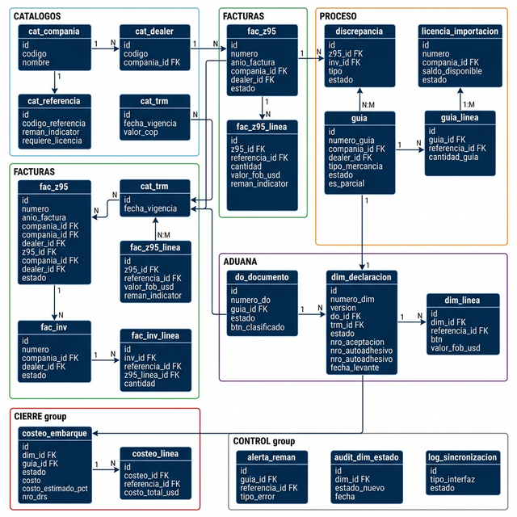
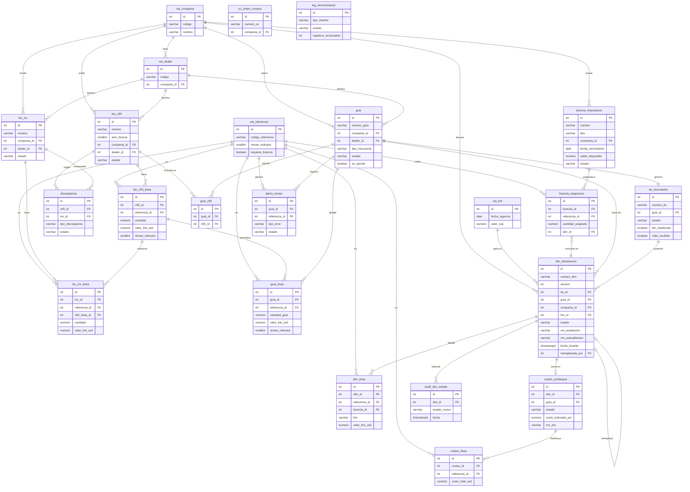

# Modelo de Datos PostgreSQL — CrossDocking SII 2.0

**Versión:** 1.0 | **Fecha:** 2026-03-04 | **Basado en:** HU-CD-26 a HU-CD-41

---

## MER — Diagrama Entidad-Relación

> Imagen generada desde el modelo de datos. Para versión interactiva: importar `modelo_crossdocking.sql` en [dbdiagram.io](https://dbdiagram.io) → `Import → PostgreSQL`.

---

### Versión código (Mermaid — para GitHub/mermaid.live)

---

## Cómo visualizar este MER

| Opción | Herramienta | Cómo |
|--------|------------|------|
| **Gratis online** | [dbdiagram.io](https://dbdiagram.io) | Pegar el SQL con `Import → PostgreSQL` |
| **Gratis online** | [drawdb.vercel.app](https://drawdb.vercel.app) | Importar el `.sql` directamente |
| **Desktop local** | [DBeaver](https://dbeaver.io) | Conectar a PostgreSQL → clic derecho en esquema → *ER Diagram* |
| **Desktop local** | pgAdmin 4 | Menú *Tools → ERD Tool* |
| **VS Code** | Extension *ERD Editor* | Abrir el `.sql` y generar diagrama |
| **Mermaid online** | [mermaid.live](https://mermaid.live) | Pegar el bloque `erDiagram` de arriba |

---

## Archivo principal

[`modelo_crossdocking.sql`](./modelo_crossdocking.sql) — Script DDL completo para PostgreSQL.

---

## Módulos y Tablas

| Módulo | Tablas | HU de referencia |
|--------|--------|-----------------|
| **0 – Catálogos** | `cat_compania`, `cat_dealer`, `cat_transportadora`, `cat_via_transporte`, `cat_modalidad_dim`, `cat_tipo_dim`, `cat_aduana`, `cat_tipo_embalaje`, `cat_referencia`, `cat_trm` | HU-CD-26, 33, 35, 39 |
| **1 – Facturas Z95** | `fac_z95`, `fac_z95_linea` | HU-CD-26, 27, 29, 30 |
| **2 – Facturas INV** | `fac_inv`, `fac_inv_linea` | HU-CD-26, 27, 29 |
| **3 – OC** | `oc_orden_compra` | HU-CD-26, 29 |
| **4 – Consolidado DHL** | `consolidado_dhl`, `consolidado_dhl_linea` | HU-CD-26 |
| **5 – Discrepancias** | `discrepancia` | HU-CD-28 |
| **6 – Licencias** | `licencia_importacion`, `licencia_asignacion` | HU-CD-32, 34 |
| **7 – Guías** | `guia`, `guia_z95`, `guia_linea` | HU-CD-31, 33, 35, 36 |
| **8 – DO** | `do_documento` | HU-CD-37 |
| **9 – DIM** | `dim_declaracion`, `dim_linea` | HU-CD-39, 40 |
| **10 – Costeo** | `costeo_embarque`, `costeo_linea` | HU-CD-41 |
| **11 – Alertas Reman** | `alerta_reman` | HU-CD-34 |
| **12 – Auditoría** | `log_sincronizacion`, `audit_dim_estado` | HU-CD-29, 40 |

---

## Decisiones de Diseño Clave

| # | Decisión | Justificación |
|---|----------|---------------|
| 1 | **Clave compuesta Z95** (numero + anio + compania) | CAT reutiliza consecutivos cada ~2 años (HU-CD-30) |
| 2 | **Reman Indicator** en z95_linea, inv_linea y guia_linea | El tipo de mercancía es por línea, no por factura |
| 3 | **Control de versiones** en DIM (`version` + `reemplazada_por`) | Una DIM nunca se modifica — se crea nueva versión (HU-CD-39) |
| 4 | **Estados secuenciales** con CHECK | Impide saltos de estado (HU-CD-40) |
| 5 | **`costo_estimado_pct` parametrizable** | El 2% puede cambiar — no hardcodeado (HU-CD-41) |
| 6 | **`saldo_disponible`** en licencia | Se descuenta al transmitir DIM, no al crear borrador (HU-CD-32) |
| 7 | **`es_parcial`** en guía | Permite parcialización de embarques (HU-CD-31) |
| 8 | **`audit_dim_estado`** inmutable | Historial de cambios de estado (HU-CD-40 RN-04) |

---

## Pendientes Pre-Desarrollo

> [!IMPORTANT]
> Resolver antes de finalizar el modelo:
> 1. **Tabla 1 de Dealers** — Commex debe entregar el catálogo oficial.
> 2. **Costo estimado** — Costos debe confirmar % y base de cálculo.
> 3. **BTN en REQ-34** — ¿Viene de Dynamics o se parametriza en SII?
> 4. **Fuente de TRM** — ¿API Banco de la República o carga manual?
> 5. **Interfaz FileZilla** — Formato exacto del archivo enviado a SIACO.
