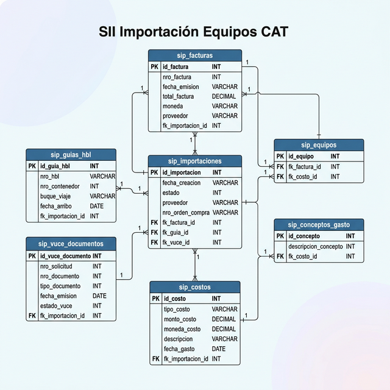
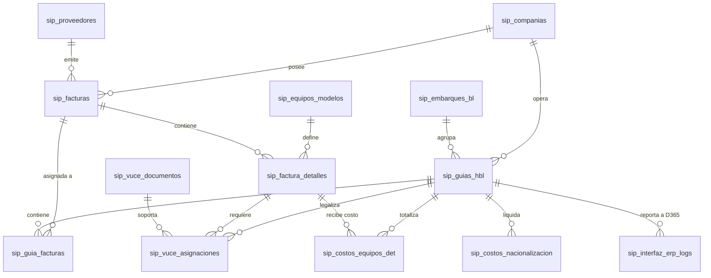

# Modelo de Datos PostgreSQL — Importación Equipos CAT

**Versión:** 1.0 | **Fecha:** 2026-03-05 | **Basado en:** REQ-15 a REQ-22

---

## MER — Diagrama Entidad-Relación

> Imagen generada desde el modelo de datos. Para versión interactiva: importar `modelo_equipos_cat.sql` en [dbdiagram.io](https://dbdiagram.io) → `Import → PostgreSQL`.

---

## Módulos del Sistema

| Módulo | Tablas Clave | Requerimientos |
| :--- | :--- | :--- |
| **0. Catálogos** | `sip_companias`, `sip_proveedores`, `sip_equipos_modelos` | REQ-15 |
| **1. Facturación** | `sip_facturas`, `sip_factura_detalles` | REQ-15, REQ-20 (AF) |
| **2. Logística** | `sip_embarques_bl`, `sip_guias_hbl` | REQ-16, REQ-18 |
| **3. VUCE** | `sip_vuce_documentos`, `sip_vuce_asignaciones` | REQ-17 |
| **4. Costos** | `sip_costos_nacionalizacion`, `sip_costos_equipos_det` | REQ-19 |
| **5. Consolidación** | `sip_interfaz_erp_logs` | REQ-22 |

---

## Decisiones de Diseño Clave

1.  **Persistencia de Activo Fijo (AF)**: El flag `es_activo_fijo` nace en la factura y se replica en el detalle de costos. Esto asegura que el cálculo de IVA y la cuenta contable en el ERP sean consistentes con la tipificación inicial.
2.  **HBL como Eje**: La tabla `sip_guias_hbl` actúa como el centro de gravedad del proceso. Los costos se cargan a la guía y luego se prorratean a los equipos asociados a ella.
3.  **Diferenciación Técnica (VUCE)**: Se permite vincular múltiples documentos VUCE a un mismo equipo o guía, soportando casos donde un equipo requiere tanto Registro como Licencia.
4.  **Integridad D365**: La tabla `sip_interfaz_erp_logs` almacena el payload JSON enviado al ERP, facilitando la auditoría y el reintento en caso de fallos en el servicio de *Landed Cost*.

---

## Archivo de Esquema

- [modelo_equipos_cat.sql](./modelo_equipos_cat.sql) — Script completo de creación para PostgreSQL.
